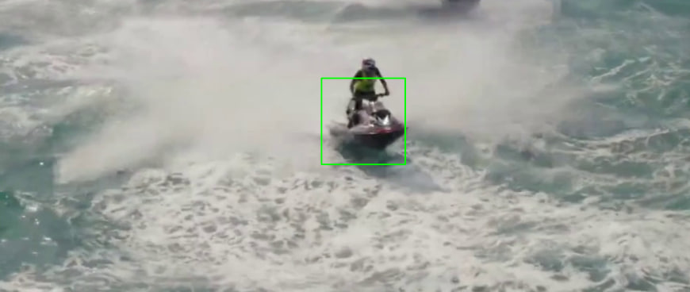

# 🛥️ Detection_Jetski

## 📌 About

`detection_Jetski` is a computer vision project focused on detecting **jetskis** in images and videos. Since jetskis are not included in the standard YOLOv5 object detection classes, a custom dataset was collected and used to train the model. The project lays the foundation for future features like speed estimation and behavior tracking.

---

## 🚀 Project Overview

The goal of this project is to develop a YOLO-based detection model for identifying jetskis on water. This is essential for applications in marine safety, surveillance, and autonomous systems.

-  **Problem**: Jetskis are not included in YOLO's default object classes.
-  **Solution**: A custom dataset was sourced from [Roboflow](https://roboflow.com/), annotated specifically for jetskis.
-  **Model**: YOLOv8 with custom training using transfer learning.
-  **Techniques Used**:
  - Image augmentations (flip, blur, exposure, etc.)
  - Mosaic augmentation for improving small-object detection
  - Custom anchor tuning

---

## 🖼️ Dataset

- Sourced from Roboflow with over **1000+ labeled images**.
- Includes various jetski positions, angles, lighting, and environments.
- Preprocessing and augmentation performed via Roboflow and Albumentations.

---

## 🧠 Model Training

- Base Model: `yolov8s.pt`
- Custom training via PyTorch
- Augmentations: Rotation, flipping, hue/saturation, blur, exposure/contrast, cropping
- Evaluation: mAP@0.5, precision, recall metrics

---

## 📈 Results

- The model shows promising detection of jetskis in real-world water scenes.
- Performs well across varying backgrounds and lighting conditions.
- Future work will include:
  - **Speed estimation** using optical flow and frame-based object tracking
  - **Multi-object tracking (MOT)** for behavior analysis

---

## 🛠️ Technologies Used

- Python
- YOLOv5 (Ultralytics)
- PyTorch
- Roboflow
- OpenCV
- Albumentations
- Google Colab / Jupyter

